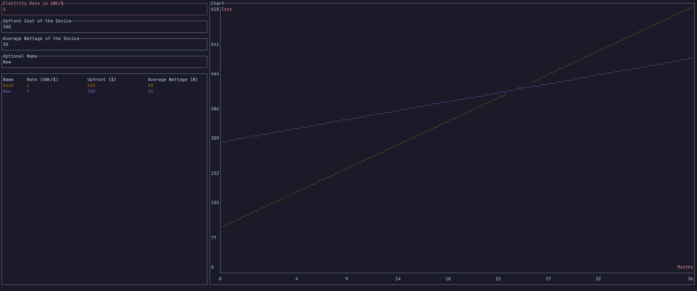

### About
pgraph is a simple TUI utility to compare upfront and recurring electricity costs of devices.

### Building
The final executable should be found under `./target/release/pgraph`. Make sure to have Rust installed on your system, or use the provided Nix flake.
```sh
git clone https://github.com/Shringe/pgraph.git
cd pgraph
cargo build --release
```
### Usage
To run the main TUI, just run the executable:
`./target/release/pgraph`

For more options: 
`./target/release/pgraph --help`

### Screenshots

